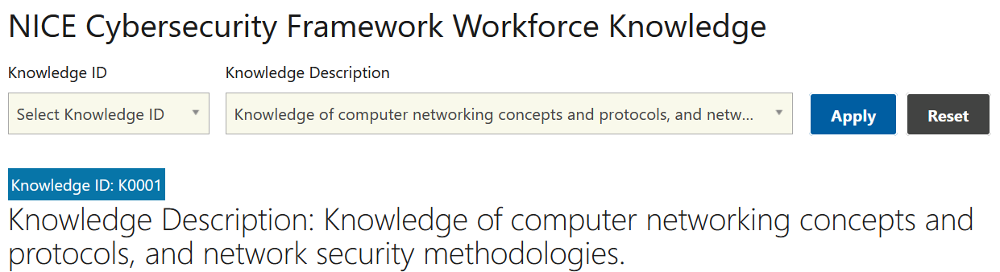

# Nice Knowledge (5 pts)

## Question:

Knowledge of computer networking concepts and protocols, and network security methodologies.

### Answer:

K0001

### Solution:

The NICE Security Framework for Workforce Skills can be found at the following website:

https://niccs.cisa.gov/workforce-development/cyber-security-workforce-framework/knowledge

We can enter the questions into the description textbox and select Apply so that the following result is displayed:

The solution to the challenge is the Knowledge ID, which is K0001.

| Previous Challenge | [Return to Challenges](/Challenges/../../../#modules) | [Next Challenge](/Challenges/Analyze/2) |
| :------- | :-----: | ------: |