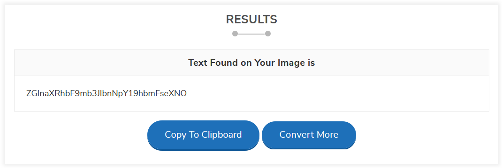

# Binwalk It Off (50 points)

File(s): [Top10.jpg](Top10.jpg) [1,881 KB]

## Question:

More steganography? You might need some more advanced tools for this one.

## Answer:

ZGInaXRhbF9mb3JlbnNpY19hbmFseXNO

## Solution:

Our hint for this question is the name of the challenge: Binwalk It Off. Our "advanced tool" will be the [binwalk tool](https://tools.kali.org/forensics/binwalk). You can install this tool on an Ubuntu distribution by running the following commands:

```bash
sudo apt-get update -y
sudo apt-get install -y binwalk
```

This process may take a few minutes. Once it is complete, we can run the following command to extract hidden information from the file:


So, it looks like binwalk managed to extract a hidden .gzip file from the image. We can unzip this file as shown below to discover what is hidden inside:


We've found the flag! We can go ahead and view the flagisinhere.png file to view the flag:


If you're like me and hesitate at the thought of trying to discern between lowercase l's and uppercase I's and between uppercase O's and 0's, or of typing all of this out character by character, you can visit the following [website](https://smallseotools.com/image-to-text-converter/) to have it extract the text for us:

[](https://smallseotools.com/image-to-text-converter/)

| [Previous Challenge](/Challenges/Analyze/9/README.md#question) | [Return to Challenges](/Challenges/../../../#modules) | [Next Challenge](/Challenges/Analyze/11/README.md#question) |
| :------- | :-----: | ------: |