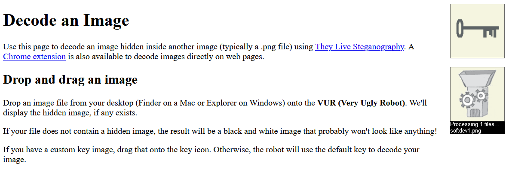
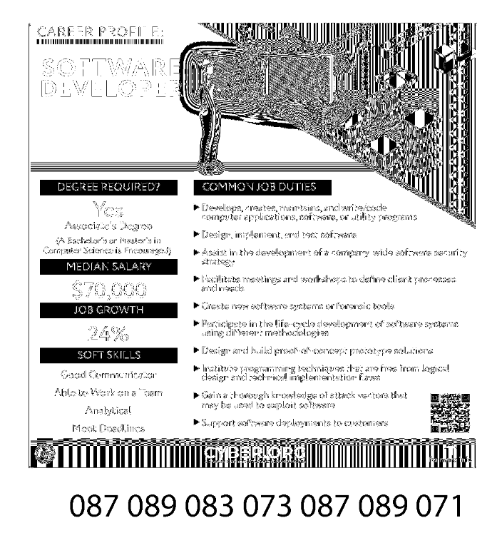
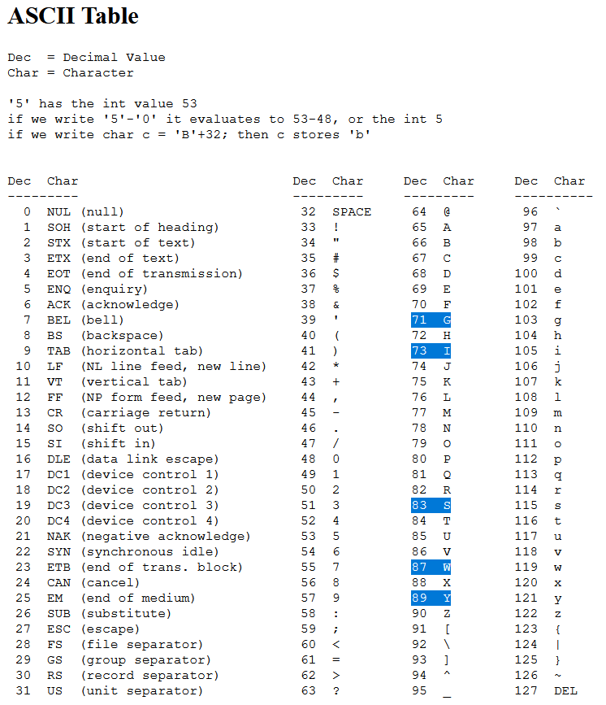

# Nothing to See Here (60 points)

File(s): [softdev1.png](softdev1.png) [344 KB]

## Question:

Or maybe there is ...

## Answer:

WYSIWYG

## Solution:

Just looking at the image, nothing pops out as strange. However, we can use the [Very Ugly Robot (VUR)](https://osric.com/chris/steganography/decode.html) to help us out with this:

---

[](https://osric.com/chris/steganography/decode.html)

---

By dropping our image in the VUR, we will get the resulting image:

---



---

It looks like some text was hidden at the bottom of the image. We can turn to the [ASCII table](https://www.cs.cmu.edu/~pattis/15-1XX/common/handouts/ascii.html) in order to decode the flag:

[](https://www.cs.cmu.edu/~pattis/15-1XX/common/handouts/ascii.html)

The numbers correspond to several uppercase letters, which when decoded give us the following as our flag:

```
087 089 083 073 087 089 071
-->
WYSIWYG
```

| [Previous Challenge](/Challenges/Analyze/10/README.md) | [Return to Challenges](/Challenges/../../../#modules) | [Next Challenge](/Challenges/Collect-And-Operate/1/README.md) |
| :------- | :-----: | ------: |