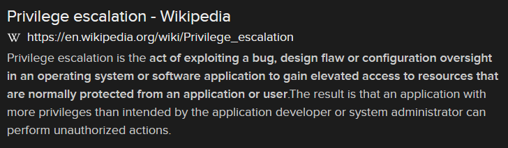

# Take Me Higher (5 pts)

## Question:

The act of exploiting a bug, design flaw or configuration oversight in an operating system or software application to gain elevated access to resources that are normally protected from an application or user.

## Answer:

Privilege escalation

## Solution:

We can perform a Google search on the given definition to get the following search result:

Based on our search, the solution to the challenge is "privilege escalation".

(As an aside, the flag makes sense given the challenge title "Take Me Higher".)

| [Previous Challenge](/Challenges/Analyze/1/README.md) | [Return to Challenges](/Challenges/../../../#modules) | [Next Challenge](/Challenges/Analyze/3/README.md) |
| :------- | :-----: | ------: |