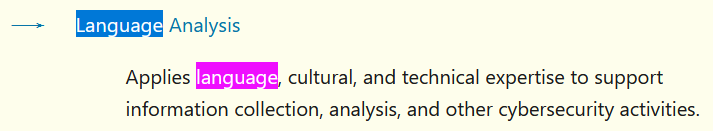

# Languages (8 points)

## Question:

Which NICE Specialty Area involves collecting and disseminating information about cyber threat actor cultural aspects, including language?

## Answer:

Language Analysis

## Solution:

The NICE Cybersecurity Framework for Categories/Specialty Areas can be found at the following website:

https://niccs.cisa.gov/workforce-development/cyber-security-workforce-framework?category=Analyze

We can use our browser's search feature using CRTL-F and the search term "language" to find the following Specialty Area:

The solution to the challenge is the name of the Specialty Area, which is Language Analysis.

| [Previous Challenge](/Challenges/Analyze/2/README.md) | [Return to Challenges](/Challenges/../../../#modules) | [Next Challenge](/Challenges/Analyze/4/README.md) |
| :------- | :-----: | ------: |