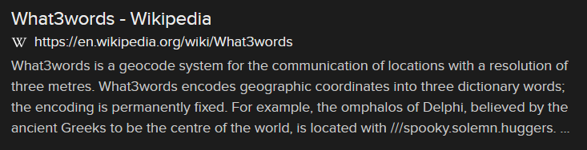
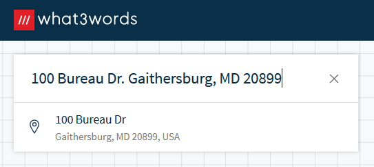
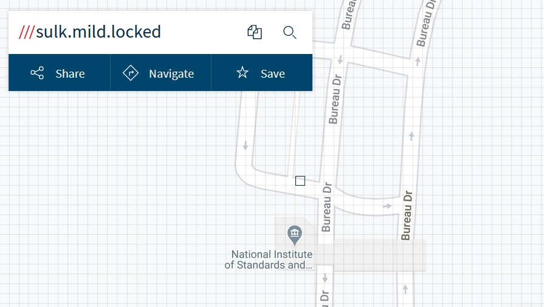

# Where Art Thou? (8 points)

## Question:

What 3 words?

100 Bureau Dr.
Gaithersburg, MD 20899

## Answer:

sulk.mild.locked

## Solution:

The key to this challenge is the phrase "What 3 words?" Performing the following Google search, we can discover what this phrase refers to:

So, the "3 words" that we're looking for represent a geographical location. We can convert our given street address into the what3words geocode system by visiting the [what3words website](https://what3words.com/) and entering the address there:

The following is the result:

It looks like we've found the NIST Headquarters! Its what3words address is "sulk.mild.locked".

| [Previous Challenge](/Challenges/Analyze/4/README.md#top) | [Return to Challenges](/Challenges/../../../#modules) | [Next Challenge](/Challenges/Analyze/6/README.md#top) |
| :------- | :-----: | ------: |