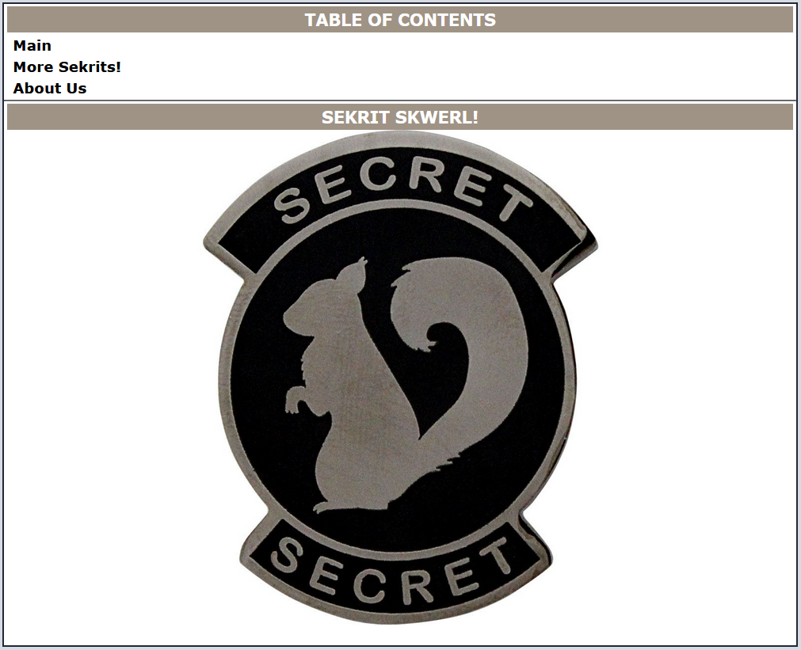

# Don't Panic (12 points)

## Question:

Find the flag on Sekrit Skwerl's Under Construction page.

[Sekrit Skwerl](http://sekritskwerl.com/)

## Answer:

sometimesFlagsAreInHTMLComments

## Solution:

Visiting the website, we will be greeted by the following page:

Well, that explains the website's moniker of "Sekrit Skwerl". We can select the [About Us](http://sekritskwerl.com/about_us.html) link to see the following page:

Looks like we've found the page under construction. To look for a hidden flag on this page, we can use our browser's Inspect Element feature by right-clicking on the page on selecting the corresponding option:

Using this feature, we will see the flag hidden within the page's HTML via a comment:

Our flag is therefore "sometimesFlagsAreInHTMLComments".

---

As an aside, if we were to visit the other page on the site looking for more "sekrits", we'd find something interesting. The following is the [More Sekrits!](http://sekritskwerl.com/more_sekrits/index.html) page:

We can again Inspect the page to find another sekrit:

It looks like an image was embedded on the page but was hidden inside of a comment. We can reveal this image by right-clicking the parent paragraph tag and selecting Edit as HTML:

We can then delete the comment tags around the image tag:

Closing out the Inspect Element pane will reveal a hidden image at the bottom of the page:

We can zoom in on this image, which will allow us to notice what appears to be Morse Code around the circumference of the image:

We can use the following [Morse Decoder website](https://morsedecoder.com/) to reveal the encoded information:

So, it seems that some squirrels have gone and made a Greatest Hits Volume 1. I wonder if there's a Volume 2...

| [Previous Challenge](/Challenges/Analyze/5/README.md#top) | [Return to Challenges](/Challenges/../../../#modules) | [Next Challenge](/Challenges/Analyze/7/README.md#top) |
| :------- | :-----: | ------: |