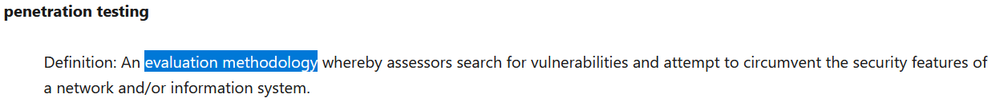

# White Hats (15 points)

## Question:

An evaluation methodology where "good guys" try to circumvent a network's security features to gain unauthorized access to information systems.

## Answer:

Penetration testing

## Solution:

We can check out the [NICCS Cybersecurity Glossary](https://niccs.cisa.gov/about-niccs/cybersecurity-glossary) to find the term which corresponds to this definition. We can CTRL-F on this page for the search term "evaluation methodology" to find our solution:

| [Previous Challenge](/Challenges/Analyze/6/README.md) | [Return to Challenges](/Challenges/../../../#modules) | [Next Challenge](/Challenges/Analyze/8/README.md) |
| :------- | :-----: | ------: |