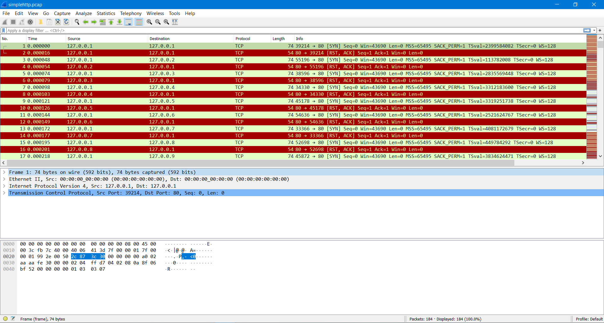
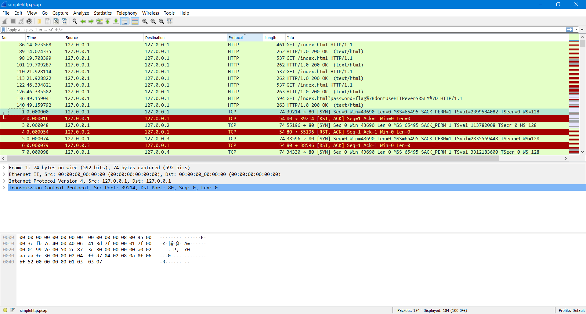
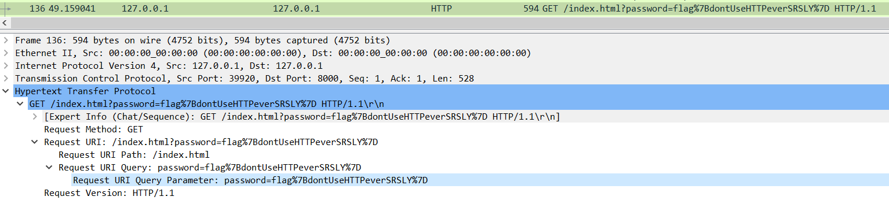
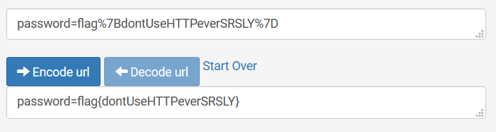

# Insecure Protocols (20 points)

File(s): [simplehttp.pcap](simplehttp.pcap) [19 KB]

## Question:

Learn some things about the wonders of insecure protocols. The answer is what is inside the curly braces.

## Answer:

dontUseHTTPeverSRSLY

## Solution:

A .pcap file is a packet capture and can be opened and analyzed with the [Wireshark](https://www.wireshark.org/download.html) software. Opening the simplehttp.pcap file with Wireshark, we will see the following:

Given the name of the challenge and of the packet capture file, we can assume that what we're interested in are packets using the HTTP protocol. We can sort the packets by their protocol to find the HTTP packets:

Looks like we've found an HTTP packet revealing a user's password, which just so happens to be our flag:

Because the "%7B" and "%7D" are URL encoded "{" and "}" characters, respectively, our flag is actually dontUseHTTPeverSRSLY. You can decode URL-encoded characters at [this website](https://www.url-encode-decode.com/):

| [Previous Challenge](/Challenges/Analyze/7/README.md#top) | [Return to Challenges](/Challenges/../../../#modules) | [Next Challenge](/Challenges/Analyze/9/README.md#top) |
| :------- | :-----: | ------: |