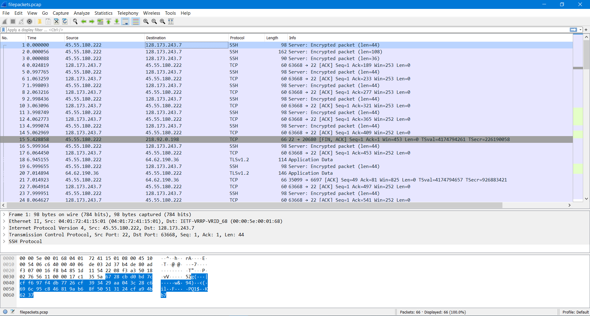
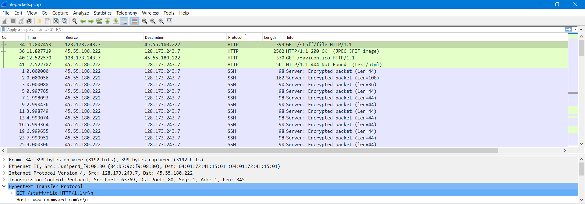
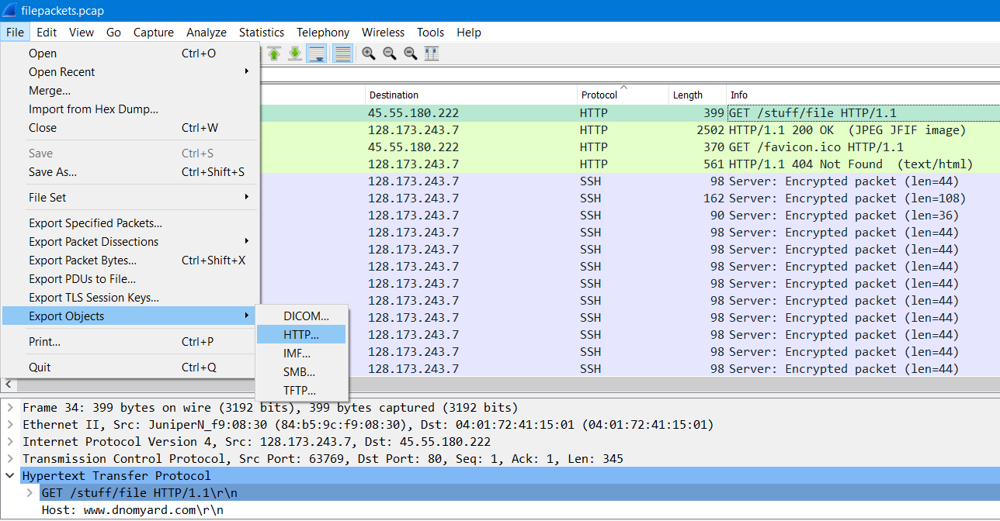
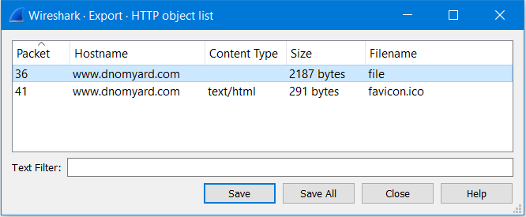
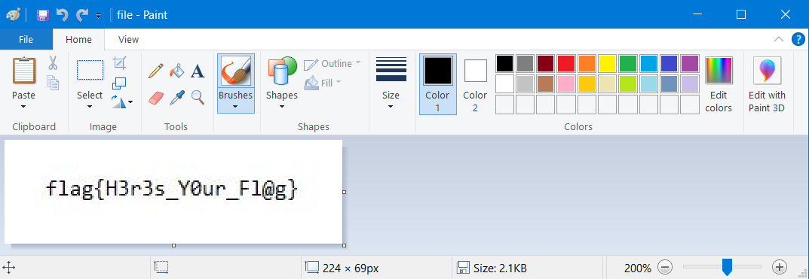

# File Extraction (40 points)

File(s): [filepackets.pcap](filepackets.pcap) [10 KB]

## Question:

Sometime you have to extract files from network packet captures

## Answer:

H3r3s_Y0ur_Fl@g

## Solution:

A .pcap file is a packet capture and can be opened and analyzed with the [Wireshark](https://www.wireshark.org/download.html) software. Opening the filepackets.pcap file with Wireshark, we will see the following:

Sorting by protocol, we can see that there's an interesting HTTP packet with a file we'd like to extract:

We can extract this file by selecting File -> Export Objects -> HTTP...

We will then be presented with the following popup, which will allow us to choose to save the [file of interest](file):

We can open this file in Paint to reveal our flag:

| [Previous Challenge](/Challenges/Analyze/8/README.md#top) | [Return to Challenges](/Challenges/../../../#modules) | [Next Challenge](/Challenges/Analyze/10/README.md#top) |
| :------- | :-----: | ------: |