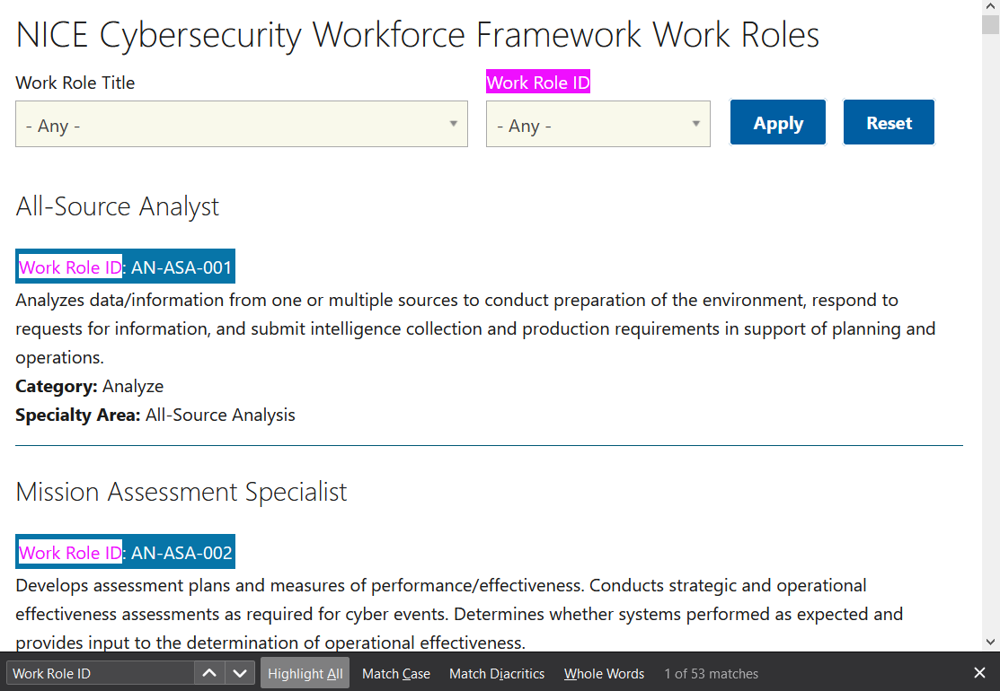

# How Many? (5 points)

## Question:

How many work roles are identified in the NICE Cybersecurity Workforce Framework?

## Answer:

52

## Solution:

The NICE Cybersecurity Framework for Workforce Framework of Work Roles can be found at the following website:

https://niccs.cisa.gov/workforce-development/cyber-security-workforce-framework/workroles

We can select Apply without entering any search terms so that all of the Work Roles are displayed on the page. We can then use CTRL+F to search for "Work Role ID" to get the following result:

 Because one of the search results is the label above the Work Role ID search box, we actually have 52 Work Roles.

| [Previous Challenge](/Challenges/Analyze/11/README.md#question) | [Return to Challenges](/Challenges/../../../#modules) | [Next Challenge](/Challenges/Collect-And-Operate/2/README.md#question) |
| :------- | :-----: | ------: |