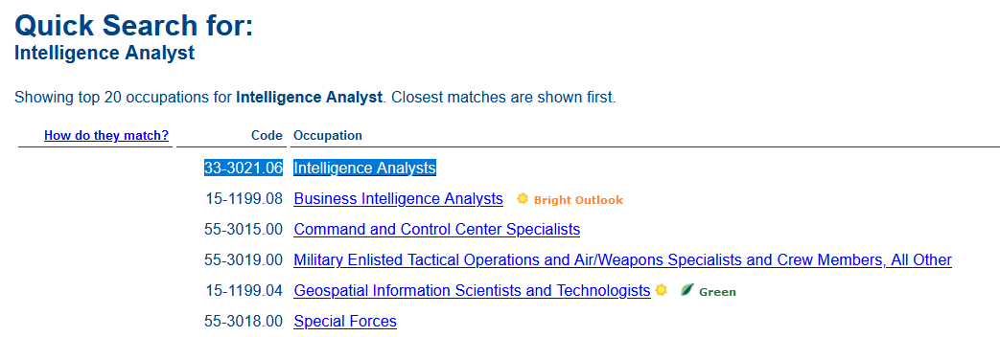

# O*Net-SOC (5 points)

## Question:

Code for Intelligence Analysts

## Answer:

33-3021.06

## Solution:

We can visit the [One*NET Online website](https://www.onetonline.org/) to do a search for our term:

Executing this search will give us the following result:

This means that our solution is 33-3021.06.

| [Previous Challenge](/Challenges/Collect-And-Operate/2/README.md) | [Return to Challenges](/Challenges/../../../#modules) | [Next Challenge](/Challenges/Collect-And-Operate/4/README.md) |
| :------- | :-----: | ------: |