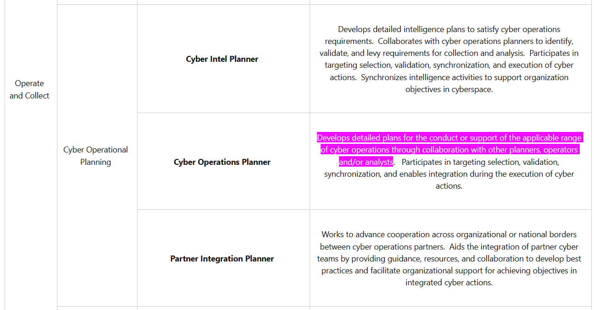

# What's the Plan? (5 points)

## Question:

Who is this? Develops detailed plans for the conduct or support of the applicable range of cyber operations through collaboration with other planners, operators and/or analysts. Participates in targeting selection, validation, synchronization, and enables integration during the execution of cyber actions.

## Answer:

Cyber Operations Planner

## Solution:

We can browse through the NICE Cybersecurity Workforce Framework of Work Roles at the following website:

https://niccs.cisa.gov/nice-cybersecurity-workforce-framework-work-roles

All of the Work Roles and their descriptions are listed here, so we can do a simple CTRL+F search to find our solution:

So, our answer is Cyber Operations Planner.

| [Previous Challenge](/Challenges/Collect-And-Operate/3/README.md) | [Return to Challenges](/Challenges/../../../#modules) | [Next Challenge](/Challenges/Collect-And-Operate/5/README.md) |
| :------- | :-----: | ------: |