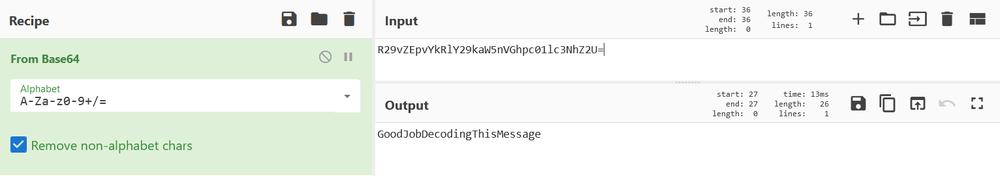

# Encoded Data (20 points)

## Question:

Cyber operators sometimes have to decode data that they have collected as part of their analysis. The message below was encoded using a scheme widely used in computer programming to represent binary data in ASCII string format using a radix-64 representation. Can you decode the message?

R29vZEpvYkRlY29kaW5nVGhpc01lc3NhZ2U=

## Answer:

GoodJobDecodingThisMessage

## Solution:

The encoding scheme described in the question is called base64. We can decode the encoded information at the [CyberChef website](https://gchq.github.io/CyberChef/#recipe=From_Base64('A-Za-z0-9%2B/%3D',true)&input=UjI5dlpFcHZZa1JsWTI5a2FXNW5WR2hwYzAxbGMzTmhaMlU9). You can see below that I've dragged over what's called a Recipe, which in this case decodes base64 encoded data:

&input=UjI5dlpFcHZZa1JsWTI5a2FXNW5WR2hwYzAxbGMzTmhaMlU9)

It reveals that our flag is GoodJobDecodingThisMessage.

I would recommend bookmarking this page, as it has many Recipes which are very useful for solving CTF challenges like this one.

| [Previous Challenge](/Challenges/Collect-And-Operate/4/README.md#top) | [Return to Challenges](/Challenges/../../../#modules) | [Next Challenge](/Challenges/Collect-And-Operate/6/README.md#top) |
| :------- | :-----: | ------: |