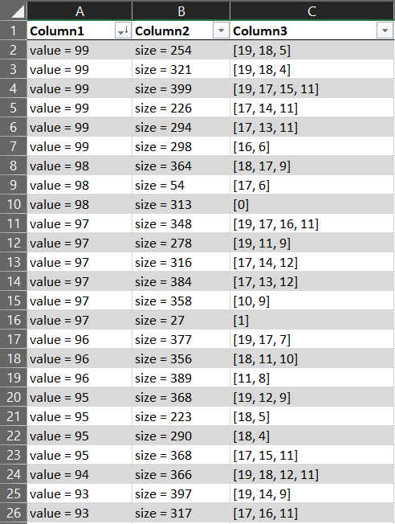

# Penetration Testing (50 points)

File(s): [fileList](fileList) [1 KB]

## Question:

Your pentest team has just infiltrated a client's corporate network and gained access to several hundred sensitive files located on an internal file server.

The files contain corporate secrets and have various values to the organization. Now, your team needs to copy the files out of the corporate network, but there's a problem. The corporation limits the amount of data that can be transferred out of the corporate network to 500 MB per day and today is the last day of the pentest engagement. Also, your team has already transferred 100 MB of data today before finding the sensitive files. There's not much time left and you need to make the most of it. Your paycheck will be much higher if you can copy the most valuable files out of the network.

Given a list of sensitive files, their values to the organization and the file sizes, determine the most valuable files that can be copied off the network by the end of the day. Your answer must be the maximum total sum of the file values (an integer value) that you are able to copy from the server.

## Answer:

477

## Solution:

I wrote the following Python program to help me in solving this challenge:

```python
from collections import deque

# Find the power set of a provided set 
def getPowerSet(S, set, n):
	if n == 0:
		sumValue = 0
		sumSize = 0
		
        # Add up the values and file sizes for each file in the subset
		for index in set:
		    sumValue += values[index]
		    sumSize += sizes[index]
		
        # If the combined file size does not exceeded the limit, output the files' combined size and value
		if sumSize <= 400:
		    print("value = " + str(sumValue) + "\tsize = " + str(sumSize) + "\t" + str(set))
		
		return

	set.append(S[n - 1])
	getPowerSet(S, set, n - 1)

	set.pop()
	getPowerSet(S, set, n - 1)

# Main function
if __name__ == '__main__':
    # List of the files' values to the organization
    values = [98, 97, 86, 80, 79, 79, 71, 65, 58, 55, 42, 38, 36, 34, 34, 30, 28, 27, 16, 4]
    # List of the files' sizes
    sizes = [313, 27, 36, 294, 139, 72, 41, 333, 342, 200, 158, 47, 137, 234, 166, 308, 257, 13, 151, 31]
    # List of indexes, used to organize files into subsets
    indexes = [0, 1, 2, 3, 4, 5, 6, 7, 8, 9, 10, 11, 12, 13, 14, 15, 16, 17, 18, 19]

    # Generate the power set of the set of files
    powerSet = []
    getPowerSet(indexes, powerSet, len(indexes))
```

In this program, I decided to approach this problem by enumerating the power set of the set of files to transfer so that I could evaluate each possible valid combination of files for the ones which would net us the highest possible value. If you'd like to read more about power sets and their uses, visit [this website](https://en.wikipedia.org/wiki/Power_set).

After running this program, we're presented with a very long list of file values, file sizes, and the indexes of the files involved in each possible transfer. We can take this output and put in into Excel, formatting it as a table, and sorting it based on the value:



We will find that the highest possible sum value of files that can be transferred within the file size limit is as shown below:


| [Previous Challenge](/Challenges/Collect-And-Operate/5/README.md) | [Return to Challenges](/Challenges/../../../#modules) | [Next Challenge](/Challenges/Collect-And-Operate/7/README.md) |
| :------- | :-----: | ------: |