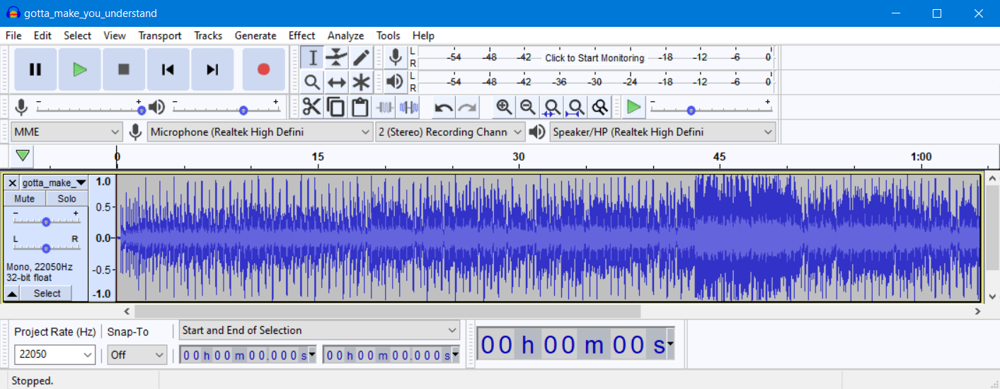
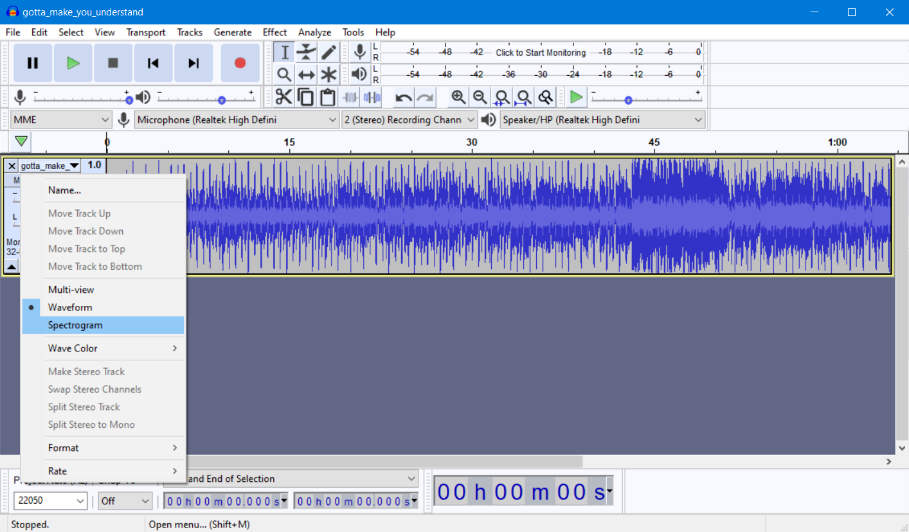
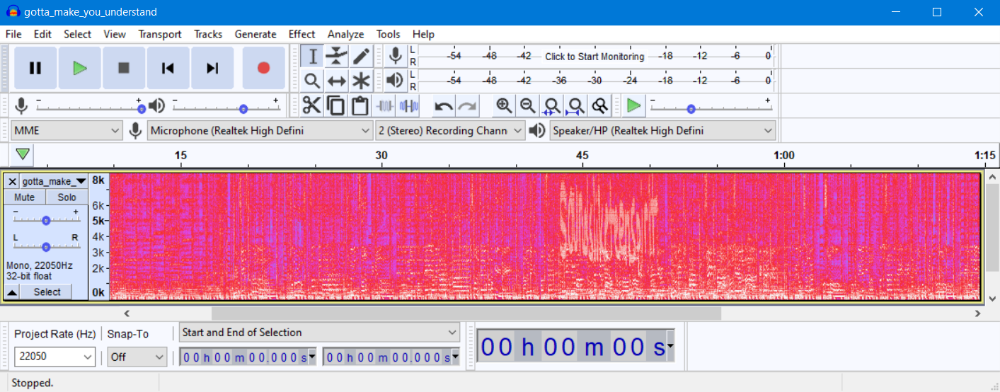
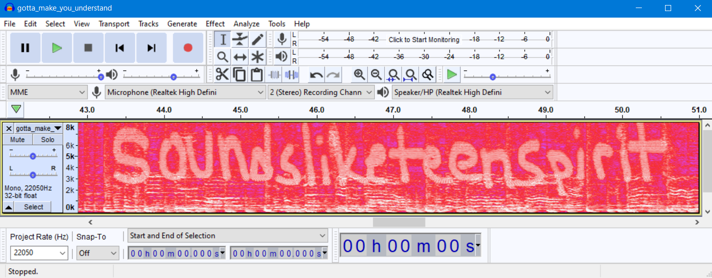

# Strange Sounds (75 points)

File(s): [gotta_make_you_understand.mp3](gotta_make_you_understand.mp3) [1,058 KB]

## Question:

Agents in the field collected this odd audio file. Can you find the embedded message?

## Answer:

soundsliketeenspirit

## Solution:

Listening to the sound file, you should notice that around the halfway-point, for about 15 seconds, you can hear strange sounds played alongside the music. These strange sounds indicate that a secret is hidden in that part of the music.

To solve this challenge, we can use [Audacity](https://www.audacityteam.org/download/windows/). This software will allow us to view the sound file as a [spectrogram](https://en.wikipedia.org/wiki/Spectrogram).

First, start up Audacity and select the options File -> Open... and select the sound file. The software will display the following waveform:

To change it to display a spectrogram, select the following option:

This will be our resulting spectrogram:

You should quickly notice an oddity in the spectrogram at around the same part of the song where we heard the strange sounds. Let's zoom in on that part. You can do that by pressing CTRL+1. After zooming-in 2 to 3 times, the hidden flag is made very clear:

| [Previous Challenge](/Challenges/Collect-And-Operate/6/README.md) | [Return to Challenges](/Challenges/../../../#modules) | [Next Challenge](/Challenges/Investigate/1/README.md) |
| :------- | :-----: | ------: |