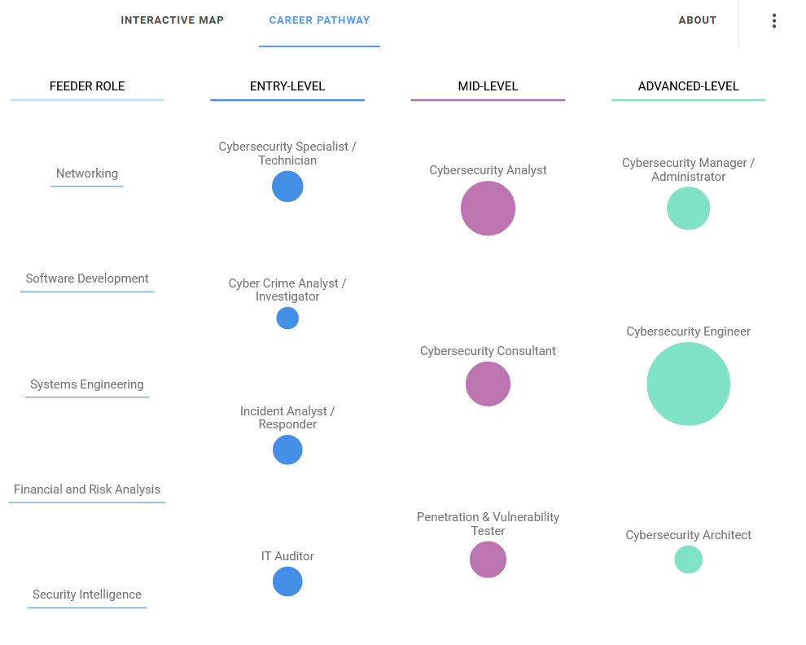
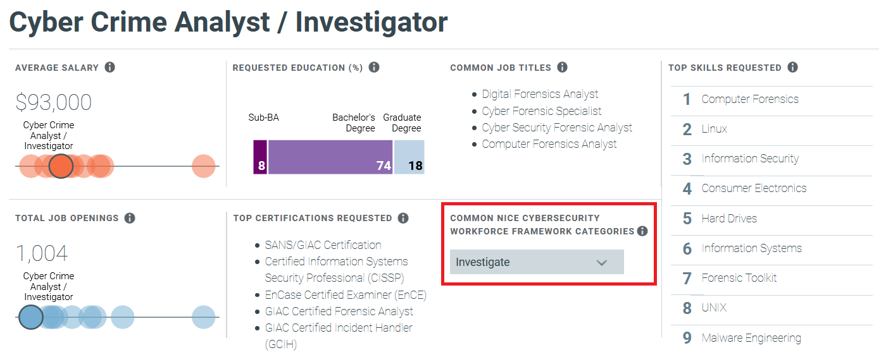

# Career Pathway (3 points)

## Question:

According to [CyberSeek](http://www.cyberseek.org/pathway.html), which entry level position lines up with the NICE cybersecurity framework category of Investigate?

## Answer:

Cyber Crime Analyst / Investigator

## Solution:

We can visit the website to see the following career pathways:

We can click on each Entry-Level bubble to see more detailed information about the position at the bottom of the page. Going through each of these, it looks like the Cyber Crime Analyst / Investigator position fits the bill:

| [Previous Challenge](/Challenges/Collect-And-Operate/7/README.md#question) | [Return to Challenges](/Challenges/../../../#modules) | [Next Challenge](/Challenges/Investigate/2/README.md#question) |
| :------- | :-----: | ------: |