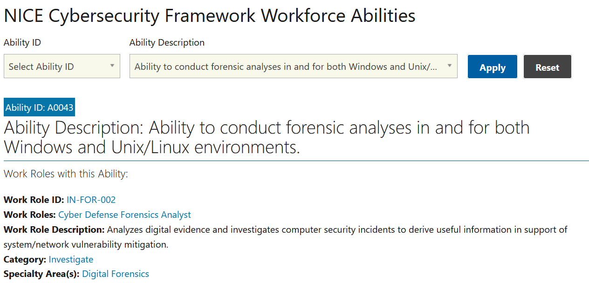

# Got Talent? (5 points)

## Question:

Ability to conduct forensic analyses in and for both Windows and Unix/Linux environments.

## Answer:

A0043

## Solution:

The NICE Cybersecurity Framework for Workforce Abilities can be found at the following website:

https://niccs.cisa.gov/workforce-development/cyber-security-workforce-framework/abilities

We can enter the question into the description textbox and select Apply so that the following result is displayed:

The solution to the challenge is the Ability ID, which is A0043.

| [Previous Challenge](/Challenges/Investigate/1/README.md) | [Return to Challenges](/Challenges/../../../#modules) | [Next Challenge](/Challenges/Investigate/3/README.md) |
| :------- | :-----: | ------: |