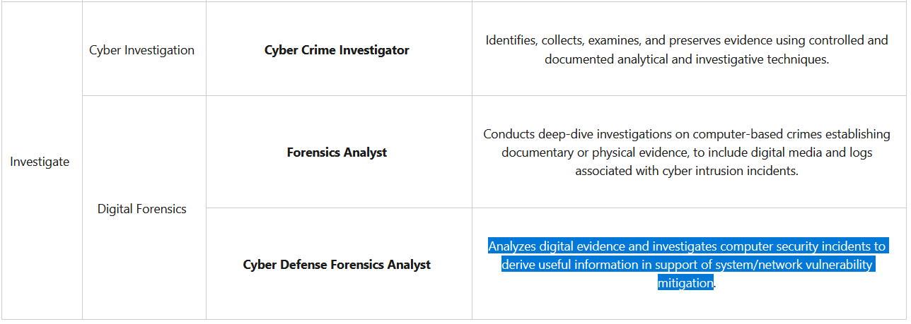

# Indefensible? (5 points)

## Question:

Analyzes digital evidence and investigates computer security incidents to derive useful information in support of system/network vulnerability mitigation.

## Answer:

Cyber Defense Forensics Analyst

## Solution:

We can browse through the NICE Cybersecurity Workforce Framework of Work Roles at the following website:

https://niccs.cisa.gov/nice-cybersecurity-workforce-framework-work-roles

All of the Work Roles and their descriptions are listed here, so we can do a simple CTRL+F search to find our solution:

So, our answer is Cyber Defense Forensics Analyst.

| [Previous Challenge](/Challenges/Investigate/2/README.md#top) | [Return to Challenges](/Challenges/../../../#modules) | [Next Challenge](/Challenges/Investigate/4/README.md#top) |
| :------- | :-----: | ------: |