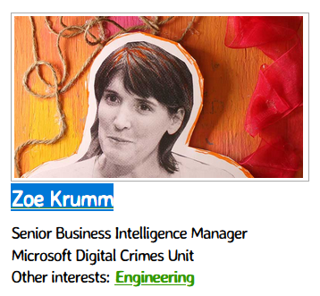
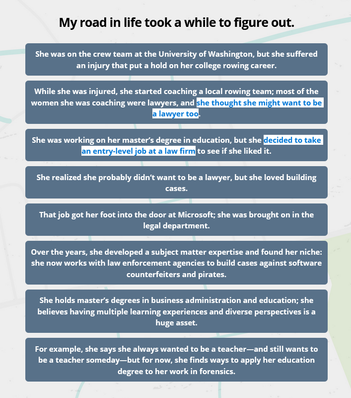

# Rowing to Forensics (5 points)

## Question:

Zoe Krumm suffered an injury in college that ended up shifting her focus from rowing to this career, which eventually helped her find her niche: building cases against software counterfeiters and pirates.

https://roadtripnation.com/explore/interests/technology

## Answer:

Law

## Solution:

We can visit the website and find Zoe Krumm's entry among some of the profile at the top of the page:

Selecting her profile and scrolling down to her list of milestones, we can see that after her rowing accident, she took up law as a profession before turning to a career in investigating digital crime:

Therefore, our answer to the challenge is Law.

| [Previous Challenge](/Challenges/Investigate/3/README.md) | [Return to Challenges](/Challenges/../../../#modules) | [Next Challenge](/Challenges/Investigate/5/README.md) |
| :------- | :-----: | ------: |