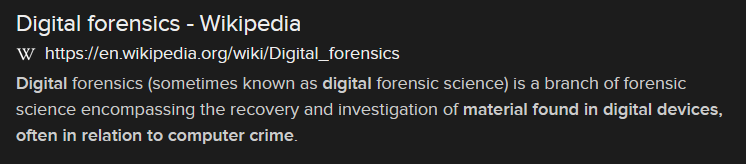

# Crime Scene Investigation (12 points)

## Question:

This is the process of recovering and investigating material found in digital devices, often in relation to computer crime.

### Answer:

Digital forensics

### Solution:

We can perform a Google search on the given definition to get the following search result:

Based on our search, the solution to the challenge is "Digital forensics".

| [Previous Challenge](/Challenges/Investigate/4) | [Return to Challenges](/Challenges/../../../#modules) | [Next Challenge](/Challenges/Investigate/6) |
| :------- | :-----: | ------: |