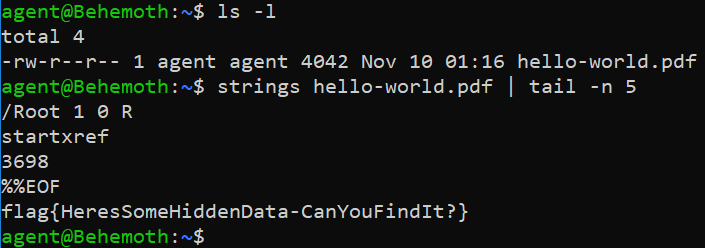

# Steganography (40 points)

File(s): [hello-world.pdf](hello-world.pdf) [4 KB]

## Question:

Steganography is the practice of hiding data in seemingly innocent-looking files. It is often most difficult just knowing when a file has hidden data in it. The attached file has hidden data - can you find it?

## Answer:

HeresSomeHiddenData-CanYouFindIt?

## Solution:

We can use the Linux command called ```strings``` to help us peer into the readable text of the .pdf file:



```strings``` will output the readable strings in the file while piping to ```tail -n 5``` will make sure that only the last 5 lines of that output is printed. In this way, we've found our flag.

| [Previous Challenge](/Challenges/Investigate/5/README.md#question) | [Return to Challenges](/Challenges/../../../#modules) | [Next Challenge](/Challenges/Investigate/7/README.md#question) |
| :------- | :-----: | ------: |