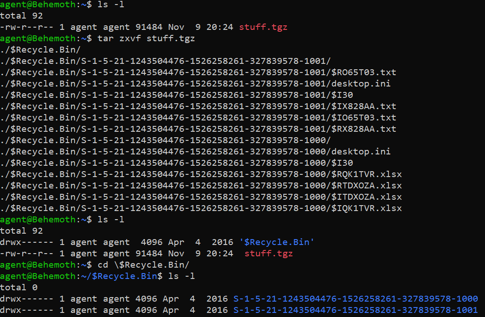
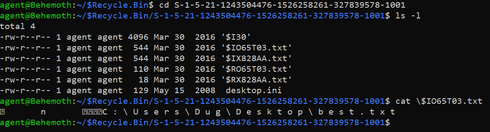

# File Recovery (65 points)

File(s): [stuff.tgz](stuff.tgz) [90 KB]

## Question:

Dug deleted an important file! Find it before it's too late.

The flag is the filename (before it was deleted, of course).

[https://vacr.io/DXIQu](https://vacr.io/DXIQu)

## Answer:

best.txt

## Solution:

First, we need to download the .tgz file from the provided link. A .tgz file is a TAR archive file that has been compressed with Gnu Zip, hence "tgz". We can unzip this file with the following Linux command:

It looks like the .tgz was a compressed Recycle Bin full of files from two different users, whose SIDs we can see in the bin. We can peruse these folders to find one particular file of interest:

So, we can confirm that the files in this folder with an SID of S-1-5-21-1243504476-1526258261-327839578-1001 are files which belonged to Dug but which were deleted. This particular file, best.txt, seems more important than Dug's other files (which are about how much he likes pizza) so this filename is our flag.

| [Previous Challenge](/Challenges/Investigate/7/README.md#question) | [Return to Challenges](/Challenges/../../../#modules) | [Next Challenge](/Challenges/Operate-And-Maintain/1/README.md#question) |
| :------- | :-----: | ------: |