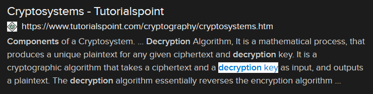

# How to Unlock! (3 points)

## Question:

The process of decrypting a message requires three components. Two of the components are the encrypted message and a decryption algorithm. What is the third component?

## Answer:

key

## Solution:

We can perform a Google search on the given definition to get the following search result:

Based on our search, the solution to the challenge is a "key".

| [Previous Challenge](/Challenges/Investigate/8/README.md#top) | [Return to Challenges](/Challenges/../../../#modules) | [Next Challenge](/Challenges/Operate-And-Maintain/2/README.md#top) |
| :------- | :-----: | ------: |