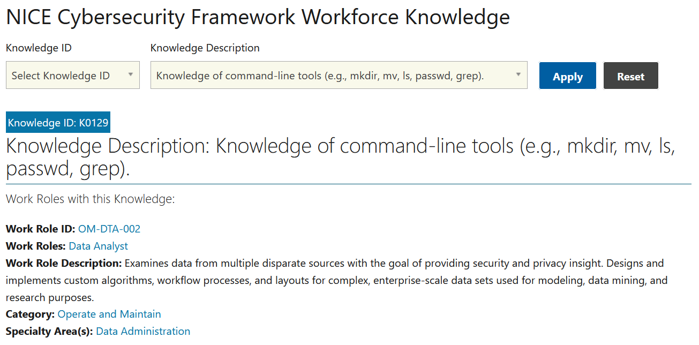

# Nice Knowledge (5 points)

## Question:

Knowledge of command-line tools (e.g., mkdir, mv, ls, passwd, grep).

## Answer:

K0129

## Solution:

The NICE Cybersecurity Framework for Workforce Knowledge can be found at the following website:

https://niccs.cisa.gov/workforce-development/cyber-security-workforce-framework/knowledge

We can enter the questions into the description textbox and select Apply so that the following result is displayed:

The solution to the challenge is the Knowledge ID, which is K0129.

| [Previous Challenge](/Challenges/Operate-And-Maintain/1/README.md#question) | [Return to Challenges](/Challenges/../../../#modules) | [Next Challenge](/Challenges/Operate-And-Maintain/3/README.md#question) |
| :------- | :-----: | ------: |