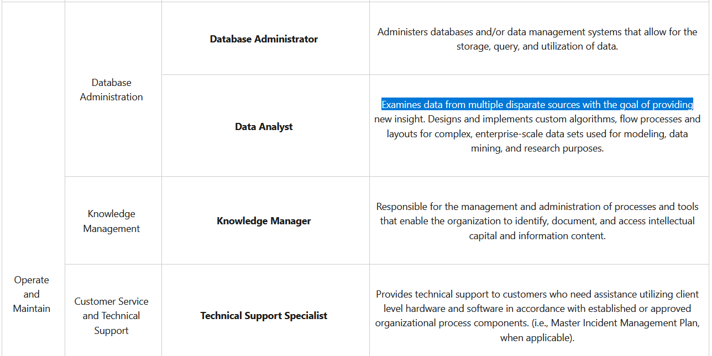

# Role Play (5 points)

## Question:

Examines data from multiple disparate sources with the goal of providing security and privacy insight. Designs and implements custom algorithms, workflow processes and layouts for complex, enterprise-scale data sets used for modeling, data mining, and research purposes.

## Answer:

Data Analyst

## Solution:

We can browse through the NICE Cybersecurity Workforce Framework of Work Roles at the following website:

https://niccs.cisa.gov/nice-cybersecurity-workforce-framework-work-roles

All of the Work Roles and their descriptions are listed here, so we can do a simple CTRL+F search to find our solution:

So, our answer is Data Analyst.

| [Previous Challenge](/Challenges/Operate-And-Maintain/2/README.md#top) | [Return to Challenges](/Challenges/../../../#modules) | [Next Challenge](/Challenges/Operate-And-Maintain/4/README.md#top) |
| :------- | :-----: | ------: |