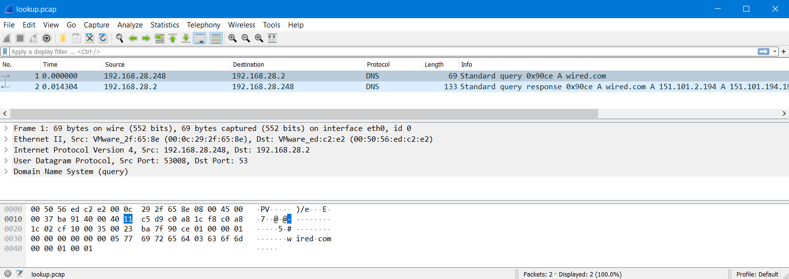
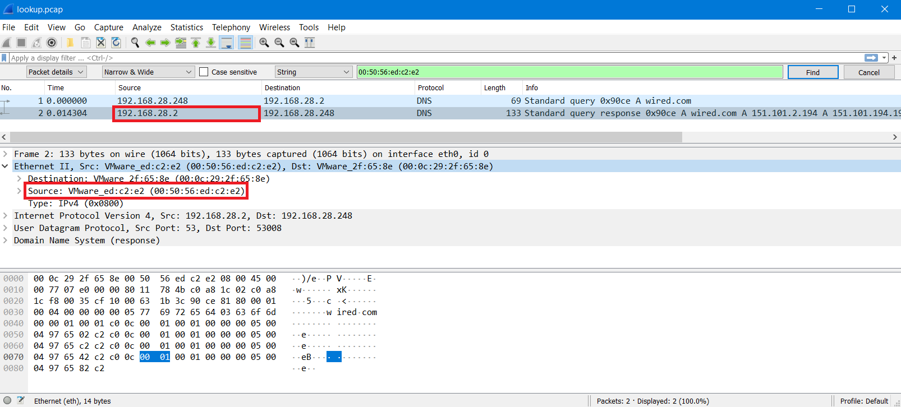

# Ethernet to IP (10 points)

File(s): [lookup.pcap](lookup.pcap) [1 KB]

## Question:

What is the Internet Protocol address of the host at 00:50:56:ed:c2:e2 in the attached packet capture file?

Free hint 1: The IP address is a sequence of four numbers between 0 and 255 separated by periods.

Free hint 2: Use Wireshark for this. It is available for download at [https://www.wireshark.org/#download](https://www.wireshark.org/#download). If you have a Virginia Cyber Range exercise area account, you can use Wireshark on your Kali Linux virtual machine.

## Answer:

192.168.28.2

## Solution:

We can open the packet capture in Wireshark to see that it contains two packets:

To find the IP address corresponding to our given MAC address of 00:50:56:ed:c2:e2, we can do a simple search of the packet details by pressing CTRL-F and entering our search term:

I've circled our source MAC address and the corresponding source IP address in the same packet. This indicates that our flag is the IP address 192.168.28.2.

| [Previous Challenge](/Challenges/Operate-And-Maintain/3/README.md) | [Return to Challenges](/Challenges/../../../#modules) | [Next Challenge](/Challenges/Operate-And-Maintain/5/README.md) |
| :------- | :-----: | ------: |