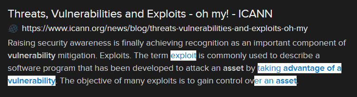

# Taking Advantage (10 points)

## Question:

A technique that takes advantage of a specific vulnerability to achieve some effect on an asset.

## Answer:

Exploit

## Solution:

We can perform a Google search on the given definition to get the following search result:

Based on our search, the solution to the challenge is "exploit".

| [Previous Challenge](/Challenges/Operate-And-Maintain/4/README.md#top) | [Return to Challenges](/Challenges/../../../#modules) | [Next Challenge](/Challenges/Operate-And-Maintain/6/README.md#top) |
| :------- | :-----: | ------: |