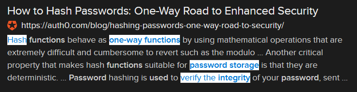

# Corned Beef (12 points)

## Question:

This term describes one-way functions used in password storage and file integrity checking

## Answer:

Hash

## Solution:

We can perform a Google search on the given definition to get the following search result:

Based on our search, the solution to the challenge is "hash".

(As an aside, the flag makes sense given the very silly challenge title "Corned Beef".)

| [Previous Challenge](/Challenges/Operate-And-Maintain/5/README.md#top) | [Return to Challenges](/Challenges/../../../#modules) | [Next Challenge](/Challenges/Operate-And-Maintain/7/README.md#top) |
| :------- | :-----: | ------: |