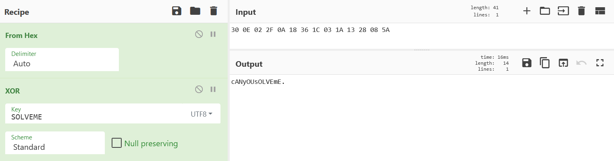

# XOR What? (20 points)

## Question:

Can you solve me? The key is "SOLVEME".

30 0E 02 2F 0A 18 36 1C 03 1A 13 28 08 5A

## Answer:

cANyOUsOLVEmE?

## Solution:

We return again to the handy [CyberChef website](https://gchq.github.io/CyberChef/). We can setup a Recipe to perform an XOR operation, a digital logic function which you can read more about [here](https://en.wikipedia.org/wiki/Exclusive_or).

In short, it's a bitwise operation that compares each bit of two operands. If the two bits being compared both have the value of 1, then the result of the operation is 0. If the two bits have the value of 0, the result of an XOR is also 0. Only when the values are different (i.e. when one value is a 0 and one value is a 1) will the result of an XOR operation be a 1.

We can use the CyberChef site to perform this operation for us, using "SOLVEME" as the key:

XOR(%7B'option':'UTF8','string':'SOLVEME'%7D,'Standard',false)&input=MzAgMEUgMDIgMkYgMEEgMTggMzYgMUMgMDMgMUEgMTMgMjggMDggNUE)

We see that our flag is "cANyOUsOLVEmE?".

| [Previous Challenge](/Challenges/Operate-And-Maintain/6/README.md#question) | [Return to Challenges](/Challenges/../../../#modules) | [Next Challenge](/Challenges/Operate-And-Maintain/8/README.md#question) |
| :------- | :-----: | ------: |