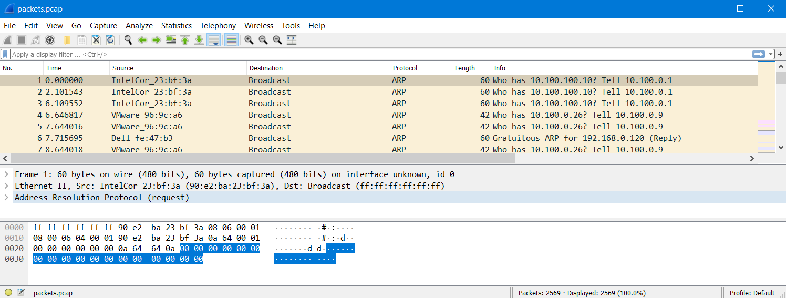
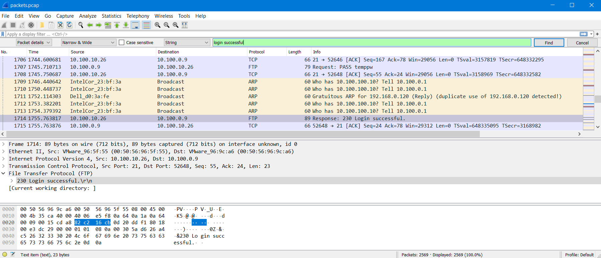

# FTP Attack (45 points)

File(s): [packets.pcap](packets.pcap) [253 KB]

## Question:

This looks like a brute-force attack on an FTP server. Can you find the password for the successful login?

## Answer:

temppw

## Solution:

We can open the packet capture in Wireshark to see that it contains quite a lot of packets:

To make it simpler for us to find the packet containing the password, we can do a search for a packet containing the phrase "login successful" in its details:

It looks like packet #1714 fits the bill. Now we just need to find which packet contains the password corresponding to this successful login. That'll be the last packet in which a password is attempted, which happens to be packet #1707. Therefore, the password is temppw. (Not a very good password, I must say.)

| [Previous Challenge](/Challenges/Operate-And-Maintain/7/README.md) | [Return to Challenges](/Challenges/../../../#modules) | [Next Challenge](/Challenges/Oversee-And-Govern/1/README.md) |
| :------- | :-----: | ------: |