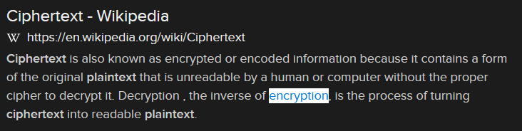

# Crypto-ing (3 points)

## Question:

What is the term for converting plaintext to ciphertext?

## Answer:

Encryption

## Solution:

We can perform a Google search on the given definition to get the following search result:

Based on our search, the solution to the challenge is "encryption".

| [Previous Challenge](/Challenges/Operate-And-Maintain/8/README.md#top) | [Return to Challenges](/Challenges/../../../#modules) | [Next Challenge](/Challenges/Oversee-And-Govern/2/README.md#top) |
| :------- | :-----: | ------: |