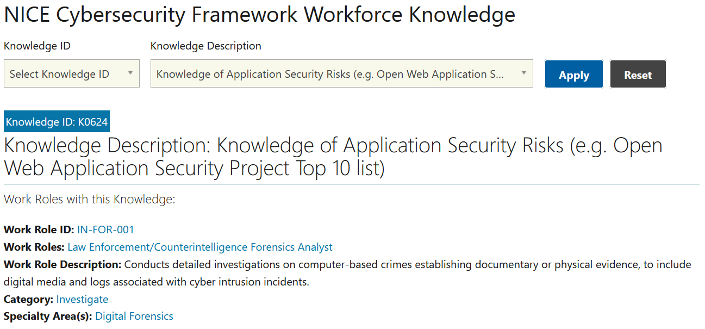

# Nice Knowledge (5 points)

## Question:

Knowledge of Application Security Risks (e.g. Open Web Application Security Project Top 10 list)

## Answer:

K0624

## Solution:

The NICE Cybersecurity Framework for Workforce Knowledge can be found at the following website:

https://niccs.cisa.gov/workforce-development/cyber-security-workforce-framework/knowledge

We can enter the questions into the description textbox and select Apply so that the following result is displayed:

The solution to the challenge is the Knowledge ID, which is K0624.

| [Previous Challenge](/Challenges/Oversee-And-Govern/1/README.md#top) | [Return to Challenges](/Challenges/../../../#modules) | [Next Challenge](/Challenges/Oversee-And-Govern/3/README.md#top) |
| :------- | :-----: | ------: |