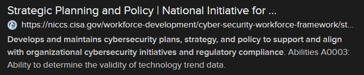
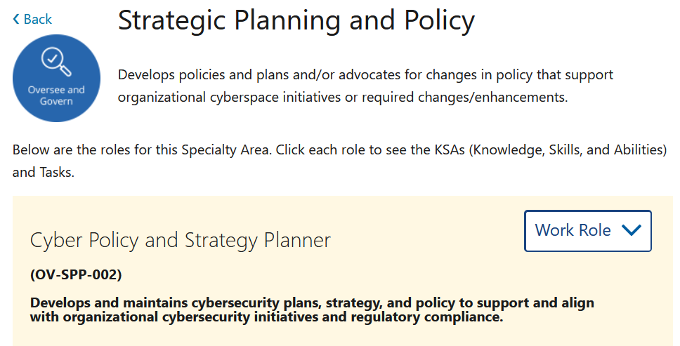

# Rollin' (5 points)

## Question:

Develops and maintains cybersecurity plans, strategy, and policy to support and align with organizational cybersecurity initiatives and regulatory compliance

## Answer:

Cyber Policy and Strategy Planner

## Solution:

We can perform a Google search on the given definition to get the following search result:

This matches up with what we're looking for, so we can click on the link to be taken to [this page](https://niccs.cisa.gov/workforce-development/cyber-security-workforce-framework/strategic-planning-and-policy):

So, our answer is Cyber Policy and Strategy Planner.

| [Previous Challenge](/Challenges/Oversee-And-Govern/2/README.md) | [Return to Challenges](/Challenges/../../../#modules) | [Next Challenge](/Challenges/Oversee-And-Govern/4/README.md) |
| :------- | :-----: | ------: |