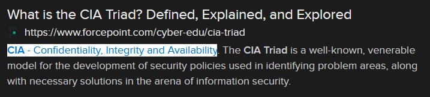

# Use It or Lose It (6 points)

## Question:

This principle of the cybersecurity CIA triad has to do with ensuring that information can be used when and where needed.

## Answer:

Availability

## Solution:

We can perform a Google search on the given definition to get the following search result:

Based on our search, the possible answers are Confidentiality, Integrity, and Availability. Looking back at the challenge question, "ensuring that information can be used when and where needed" most closely relates to Availability.

| [Previous Challenge](/Challenges/Oversee-And-Govern/3/README.md) | [Return to Challenges](/Challenges/../../../#modules) | [Next Challenge](/Challenges/Oversee-And-Govern/5/README.md) |
| :------- | :-----: | ------: |