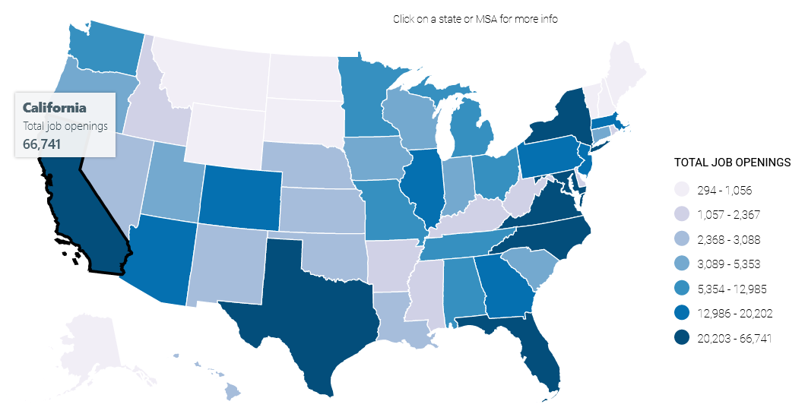

# Lots of Jobs! (7 points)

## Question:

According to CyberSeek, which state has the highest numbers of cybersecurity job openings?

## Answer:

California

## Solution:

Looking at [CyberSeek](https://www.cyberseek.org/heatmap.html), the state with the highest numbers of cybersecurity job openings is going to be the state with the deepest blue color. We can confirm this by hovering over the states to view their numbers. Checking the states with deep blue colors, California is the one with the most cybersecurity job openings:

| [Previous Challenge](/Challenges/Oversee-And-Govern/4/README.md#question) | [Return to Challenges](/Challenges/../../../#modules) | [Next Challenge](/Challenges/Oversee-And-Govern/6/README.md#question) |
| :------- | :-----: | ------: |