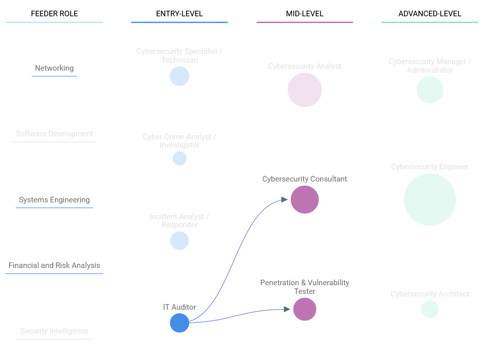

# New Roles (12 points)

## Question:

According to CyberSeek, this Entry-level role is primarily comprised of individuals from the Feeder roles Networking, Systems Engineering, and Financial and Risk Analysis.

### Answer:

IT Auditor

### Solution:

Looking at the [CyberSeek Career Pathway](https://www.cyberseek.org/pathway.html), we can determine which entry-level role meets these requirements by hovering over each bubble and comparing the feeder roles which are represented. The entry-level role which fits the bill is the IT Auditor role, as shown below:

| [Previous Challenge](/Challenges/Oversee-And-Govern/6) | [Return to Challenges](/Challenges/../../../#modules) | [Next Challenge](/Challenges/Oversee-And-Govern/8) |
| :------- | :-----: | ------: |