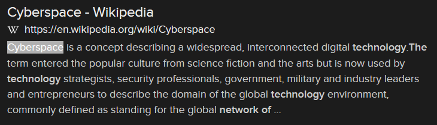

# Neuromancer (15 points)

## Question:

This term used to describe the interdependent network of information technology infrastructures that includes the Internet, telecommunications networks, computer systems, and embedded processors was coined by author William Gibson in his novel, Neuromancer.

## Answer:

Cyberspace

## Solution:

We can perform a Google search on the given definition to get the following search result:

Based on our search, the solution to the challenge is "cyberspace".

| [Previous Challenge](/Challenges/Oversee-And-Govern/7/README.md) | [Return to Challenges](/Challenges/../../../#modules) | [Next Challenge](/Challenges/Oversee-And-Govern/9/README.md) |
| :------- | :-----: | ------: |