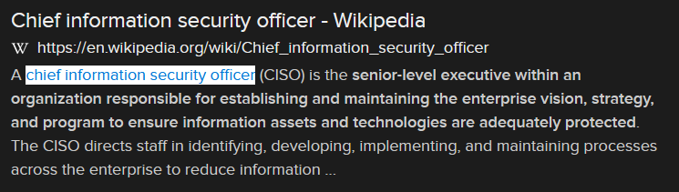

# Big Bossman (18 points)

## Question:

This cybersecurity related role is the senior-level executive within an organization responsible for establishing and maintaining the enterprise vision, strategy, and program to ensure information assets and technologies are adequately protected.

## Answer:

chief information security officer

## Solution:

We can perform a Google search on the given definition to get the following search result:

Based on our search, the solution to the challenge is "chief information security officer".

| [Previous Challenge](/Challenges/Oversee-And-Govern/8/README.md#question) | [Return to Challenges](/Challenges/../../../#modules) | [Next Challenge](/Challenges/Protect-And-Defend/1/README.md#question) |
| :------- | :-----: | ------: |