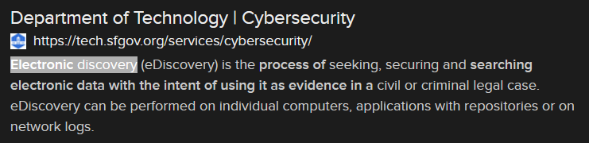

# Law and Order (2 points)

## Question:

This process involves searching for electronic data with the intent of using it as evidence in a civil or criminal legal case.

## Answer:

Electronic discovery

## Solution:

We can perform a Google search on the given definition to get the following search result:

Based on our search, the solution to the challenge is "electronic discovery".

| [Previous Challenge](/Challenges/Oversee-And-Govern/9/README.md#question) | [Return to Challenges](/Challenges/../../../#modules) | [Next Challenge](/Challenges/Protect-And-Defend/2/README.md#question) |
| :------- | :-----: | ------: |