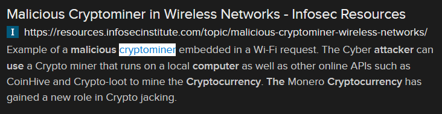

# Gold Digging (16 points)

## Question:

This malicious software will use your computer to secretly mine cryptocurrency for the attacker.

### Answer:

Cryptominer

### Solution:

We can perform a Google search on the given definition to get the following search result:

Based on our search, the solution to the challenge is "cryptominer".

| [Previous Challenge](/Challenges/Protect-And-Defend/9) | [Return to Challenges](/Challenges/../../../#modules) | [Next Challenge](/Challenges/Protect-And-Defend/11) |
| :------- | :-----: | ------: |