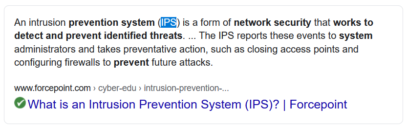

# Let Me In! (4 points)

## Question:

A network security device that works to detect and prevent identified threats.

### Answer:

IPS

### Solution:

We can perform a Google search on the given definition to get the following search result:

Based on our search, the solution to the challenge is "IPS", which is short for Intrusion Prevention System.

P.S. Just for fun:

| [Previous Challenge](/Challenges/Protect-And-Defend/1) | [Return to Challenges](/Challenges/../../../#modules) | [Next Challenge](/Challenges/Protect-And-Defend/3) |
| :------- | :-----: | ------: |