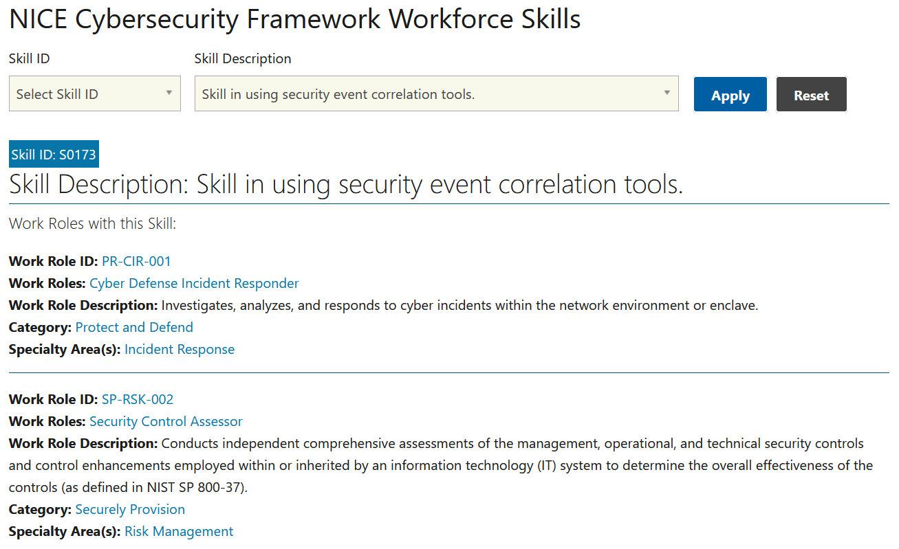

# Making Connections (5 points)

## Question:

Skill in using security event correlation tools.

## Answer:

S0173

## Solution:

The NICE Cybersecurity Framework for Workforce Skills can be found at the following website:

https://niccs.cisa.gov/workforce-development/cyber-security-workforce-framework/skills

We can enter the question into the description textbox and select Apply so that the following result is displayed:

The solution to the challenge is the Skill ID, which is S0173.

| [Previous Challenge](/Challenges/Protect-And-Defend/2/README.md#top) | [Return to Challenges](/Challenges/../../../#modules) | [Next Challenge](/Challenges/Protect-And-Defend/4/README.md#top) |
| :------- | :-----: | ------: |