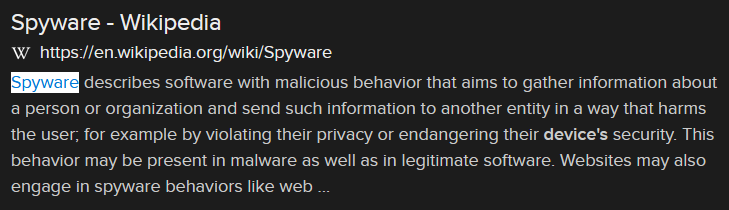

# 007 (6 points)

## Question:

What is the term for apps or programs that are surreptitiously installed on computing devices with the intent to record activity or otherwise spy on the user?

## Answer:

Spyware

## Solution:

We can perform a Google search on the given definition to get the following search result:

Based on our search, the solution to the challenge is "spyware".

| [Previous Challenge](/Challenges/Protect-And-Defend/3/README.md) | [Return to Challenges](/Challenges/../../../#modules) | [Next Challenge](/Challenges/Protect-And-Defend/5/README.md) |
| :------- | :-----: | ------: |