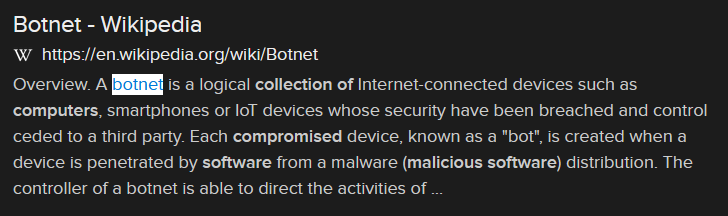

# Overlords (8 points)

## Question:

What is the term for a large collection of computers that are compromised by malicious software and controlled across a network?

### Answer:

Botnet

### Solution:

We can perform a Google search on the given definition to get the following search result:

Based on our search, the solution to the challenge is "botnet".

| [Previous Challenge](/Challenges/Protect-And-Defend/)4 | [Return to Challenges](/Challenges/../../../#modules) | [Next Challenge](/Challenges/Protect-And-Defend/6) |
| :------- | :-----: | ------: |