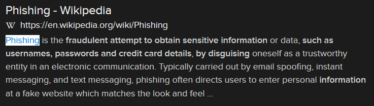

# Catch Me If You Can (10 points)

## Question:

What is the term for fraudulent attempts to obtain sensitive information such as usernames, passwords and credit card details by disguising oneself as a trustworthy entity in an electronic communication such as an email?

### Answer:

Phishing

### Solution:

We can perform a Google search on the given definition to get the following search result:

Based on our search, the solution to the challenge is "phishing".

| [Previous Challenge](/Challenges/Protect-And-Defend/5) | [Return to Challenges](/Challenges/../../../#modules) | [Next Challenge](/Challenges/Protect-And-Defend/7) |
| :------- | :-----: | ------: |