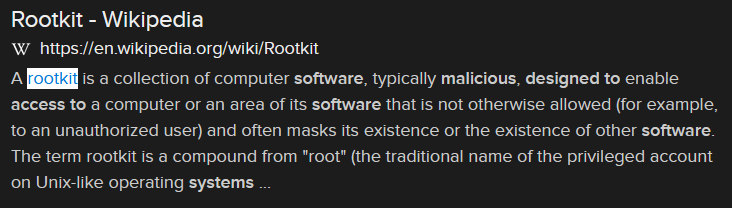

# Underground (12 points)

## Question:

What are malicious software tools with administrator-level access privileges installed on an information systems and designed to hide the presence of the tools, maintain the access privileges, and conceal the activities conducted by the tools?

## Answer:

Rootkit

## Solution:

We can perform a Google search on the given definition to get the following search result:

Based on our search, the solution to the challenge is "rootkit".

| [Previous Challenge](/Challenges/Protect-And-Defend/6/README.md) | [Return to Challenges](/Challenges/../../../#modules) | [Next Challenge](/Challenges/Protect-And-Defend/8/README.md) |
| :------- | :-----: | ------: |