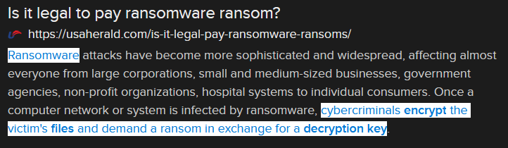

# Hostage (15 points)

## Question:

This malicious software will encrypt the files on your harddrive and only provide a decryption key when you pay hackers a hefty fee, usually in cryptocurrency.

### Answer:

Ransomware

### Solution:

We can perform a Google search on the given definition to get the following search result:

Based on our search, the solution to the challenge is "ransomware".

| [Previous Challenge](/Challenges/Protect-And-Defend/7) | [Return to Challenges](/Challenges/../../../#modules) | [Next Challenge](/Challenges/Protect-And-Defend/9) |
| :------- | :-----: | ------: |