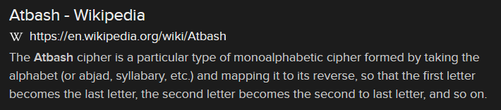
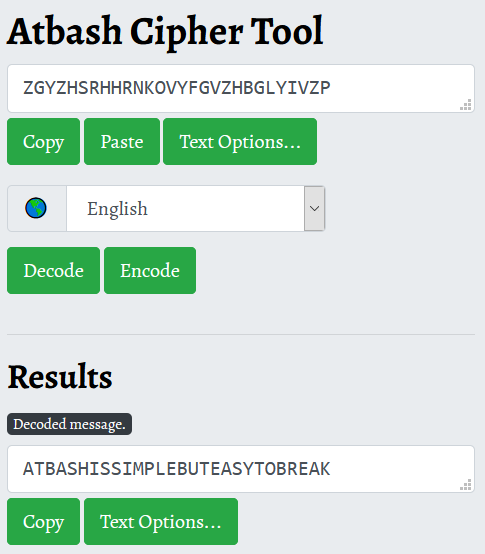

# hsabtA (15 points)

## Question:

Ciphtertext: ZGYZHSRHHRNKOVYFGVZHBGLYIVZP

Plaintext: ?

### Answer:

ATBASHISSIMPLEBUTEASYTOBREAK

### Solution:

The key to this challenge is the title: hsabtA. Reversed, this is clearly Atbash. Doing a quick Google search on it, we can see that it is a cipher:

We can decode our ciphertext by using this [Atbash Online Cipher Tool](https://www.boxentriq.com/code-breaking/atbash-cipher):

So, our flag is ATBASHISSIMPLEBUTEASYTOBREAK.

| [Previous Challenge](/Challenges/Protect-And-Defend/8) | [Return to Challenges](/Challenges/../../../#modules) | [Next Challenge](/Challenges/Protect-And-Defend/10) |
| :------- | :-----: | ------: |