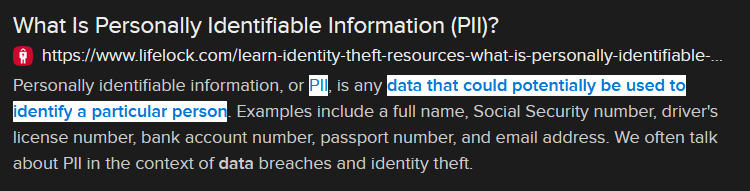

# Anonymous (3 points)

## Question:

Data that could potentially be used to identify a particular person.

## Answer:

PII

## Solution:

We can perform a Google search on the given definition to get the following search result:

Based on our search, the solution to the challenge is "PII", which is short for Personally Identifiable Information.

| [Previous Challenge](/Challenges/Protect-And-Defend/11/README.md#top) | [Return to Challenges](/Challenges/../../../#modules) | [Next Challenge](/Challenges/Securely-Provision/2/README.md#top) |
| :------- | :-----: | ------: |